# 10-minute-private-eks-containment-blueprint
Terraform-based AWS EKS blueprint for secure private clusters with automated containment, incident-response orchestration, and least-privilege IAM design.
# eks-containment-blueprint

**eks-containment-blueprint** is a Terraform-driven architecture built on the official [AWS EKS Blueprints](https://github.com/aws-ia/terraform-aws-eks-blueprints) pattern for fully private clusters.  
It extends that baseline into a **realistic incident-response and containment demo**, designed to showcase modern AWS IAM access patterns, Step Functions orchestration, and secure automation inside private VPC networks.

---

### 🧩 What It Does
- **Private EKS Cluster** - based on AWS’ “Fully Private Cluster” pattern (no public endpoint, no NAT).
- **Containment Automation** - EventBridge → Step Functions → Lambda workflow that can:
  - Label and quarantine namespaces.
  - Apply default-deny `NetworkPolicy` rules.
  - Scale down or annotate compromised workloads.
  - Capture before/after state to S3 for audit.
- **IAM Role Complexity** - Demonstrates advanced AWS-to-Kubernetes identity bridging using `AccessEntries` instead of legacy `aws-auth` mappings.
- **Evidence-Driven Response** - Each action produces verifiable artifacts (JSON snapshots, run records) for forensics and compliance.
- **Network Isolation Challenges** - Shows how private Lambda, EKS, and Step Functions communicate through Interface VPC Endpoints with no internet, no NAT, from the get go.
- **Phase 2 Containment** - PRIOR TO PHASE 3 IMPLEMENTATION: A single Lambda function would bootstrap its own Kubernetes RBAC and perform namespace-level containment (label pods, scale deployments) while remaining inside the private network. 

---

```mermaid
graph TD
    %% --- Styling ---
    classDef net fill:#e1f5fe,stroke:#01579b,stroke-width:2px,color:#01579b;
    classDef aws fill:#fff3e0,stroke:#e65100,stroke-width:2px;
    classDef compute fill:#e8f5e9,stroke:#2e7d32,stroke-width:2px;
    classDef security fill:#ffebee,stroke:#c62828,stroke-width:2px;
    classDef external fill:#f3e5f5,stroke:#4a148c,stroke-width:2px;

    %% --- External World ---
    subgraph Public_Internet ["☁️ Public Internet / Local Machine"]
        User([User / Laptop])
        Ext_Docker[Docker Hub]
    end

    %% --- AWS Cloud Boundary ---
    subgraph AWS_Cloud ["☁️ AWS Cloud (us-east-1)"]
        
        %% --- AWS Managed Control Plane (Outside VPC) ---
        subgraph AWS_Managed ["AWS Managed Services"]
            EKS_CP[("🛡️ EKS Control Plane API")]
            ECR[("📦 Private ECR")]
            S3_Bucket[("🗄️ Evidence S3 Bucket")]
            EB[⚡ EventBridge]
            SFN[⚙️ Step Functions]
            STS[🔑 AWS STS]
        end

        %% --- The Private VPC ---
        subgraph VPC ["🔒 Strictly Private VPC (No IGW/NAT)"]
            style VPC fill:#f5f5f5,stroke:#666,stroke-width:2px,stroke-dasharray: 5 5

            %% --- VPC Endpoints (Egress) ---
            subgraph VPC_Endpoints ["Gateway & Interface Endpoints"]
                VPCE_S3(VPCE: S3 Gateway)
                VPCE_ECR(VPCE: ECR API/DKR)
                VPCE_EKS(VPCE: EKS API)
                VPCE_STS(VPCE: STS Interface)
                VPCE_Logs(VPCE: CloudWatch)
            end

            %% --- Private Subnets ---
            subgraph Private_Subnet ["Private Subnet (10.0.x.x)"]
                
                %% Injected Interfaces
                Cluster_ENI{{"🔌 EKS Cluster ENI<br/>(Cross-Account Interface)"}}

                %% Bastion Component
                Bastion["🖥️ Bastion Host"]
                
                %% Lambda Component
                Responder["λ Responder Function"]

                %% K8s Worker Nodes
                subgraph K8s_Nodes ["EKS Worker Nodes"]
                    Pod_Kuma(🟢 Uptime Kuma)
                    Pod_Honey(🎯 Honey Pod)
                    NetworkPolicy{{"⛔ NetworkPolicy"}}
                end
            end
        end
    end

    %% --- Data Flows ---

    %% 1. The "Dumb Pipe" Tunnel (Observability)
    User --"1. SSM Tunnel"--> Bastion
    Bastion --"2. kubectl port-forward"--> VPCE_EKS
    VPCE_EKS --"3. Request"--> EKS_CP
    EKS_CP =="4. Stream via ENI"==> Cluster_ENI
    Cluster_ENI == "5. Intranet Traffic" ==> Pod_Kuma
    
    %% 2. The Supply Chain (Smuggling)
    Ext_Docker -.-> User
    User --"docker push"--> ECR
    ECR --"Image Pull"--> VPCE_ECR
    VPCE_ECR --> K8s_Nodes

    %% 3. The "Data Diode" (Tool Installation)
    User --"Upload Binary"--> S3_Bucket
    S3_Bucket --"Download"--> VPCE_S3
    VPCE_S3 --> Bastion

    %% 4. The Attack & Response Loop
    User --"Trigger"--> EB
    EB --> SFN
    SFN --> Responder
    
    %% 5. Lambda Logic
    Responder --"1. Get Token"--> VPCE_STS
    VPCE_STS --> STS
    Responder --"2. Apply Policy"--> VPCE_EKS
    VPCE_EKS --> EKS_CP
    
    %% 6. Evidence Capture
    Responder --"Write JSON"--> VPCE_S3
    VPCE_S3 --> S3_Bucket

    %% Styling Assignment
    class VPCE_S3,VPCE_ECR,VPCE_EKS,VPCE_STS,VPCE_Logs,Cluster_ENI net;
    class EKS_CP,ECR,S3_Bucket,EB,SFN,STS aws;
    class Bastion,Responder,Pod_Kuma,Pod_Honey compute;
    class NetworkPolicy security;
    class User,Ext_Docker external;
```

Note: The above chart can be kind of confusing but to clarify, Step Functions live in the AWS Public Zone (the Regional Service layer). It never actually crosses the private your subnet to trigger the Lambda. Instead, it talks to the Lambda Service, which spawns an execution environment attached to the VPC.

### ⚙️ Technologies
| Layer | Tools |
|-------|--------|
| Infrastructure | Terraform, AWS EKS Blueprints |
| Orchestration | AWS Step Functions, EventBridge |
| Execution | AWS Lambda (Python, Kubernetes SDK) |
| Evidence & Audit | Amazon S3, CloudWatch Logs |
| IAM Integration | Access Entries, Fine-Grained Role Policies |

---

### 🧠 Purpose
This project demonstrates how real-world cloud security engineers handle:
- **Complex IAM Role chains**
- **Private-network constraints**
- **Automated incident containment**
- **Forensic evidence generation**
  
Inspired by recent Cloud Security Podcast titled: Incident Response of Kubernetes and how to Automate Containment with guest Damien Burks and host Ashish Rajan. The project hopes to show a workable method in a modern IaC AWS environments, this blueprint translates those theoretical challenges into something you can **deploy, observe, and extend**.

---

### 🚀 Quick Start
```bash
git clone https://github.com/AustinTO/eks-containment-blueprint.git
cd eks-containment-blueprint
terraform init
TF_LOG=ERROR terraform apply
```

---

### ✅ Current State (Phase 3: The Digital Cage)
- Fully private EKS cluster (no internet gateway, no public endpoint) with Lambda/Step Functions/EventBridge traffic pinned to interface endpoints (S3, ECR, STS, Logs).
- Event-driven containment that injects a **deny-all NetworkPolicy** to isolate pods while keeping them alive for RAM forensics.
- Lambda responder authenticates with a manually constructed SigV4 STS token, prepends the required `k8s-aws-v1.` prefix, and targets the regional STS endpoint to satisfy EKS validation.
- Access control is fully declarative via `aws_eks_access_entry` + `aws_eks_access_policy_association`-no `aws-auth` ConfigMap drift, cluster-admin granted in IaC for bastion and Lambda roles.
- Uptime Kuma stays private; validation happens through a chained SSM → bastion → `kubectl port-forward` tunnel (no ingress, no load balancer).
- End-to-end detection-to-containment completes in under 40 seconds; evidence is written to S3 as `audit.json` / `containment.json` but only viewable via either bastion port forwarding chain, or via s3 or containment s3 dashboard(lambda reading s3).


### 🧭 Phase 3 Technical Deep Dive
**Architectural goal:** forensic-grade, event-driven containment inside a strictly private Kubernetes cluster with no public endpoints, no internet egress, no NAT.

**Core constraints**
- Dark site networking; all outbound traffic forced through interface endpoints.
- No inbound management: no SSH, no ingress controllers, no load balancers.
- Containment must be non-destructive to preserve memory and process evidence.

**Engineering challenges & solutions**
1) **Bootstrapping tools without internet**  
   - Problem: Bastion needed `kubectl` but could not `curl` over the internet.  
   - Solution: Use the S3 VPC Endpoint as a private transfer path, download binary locally → upload to private bucket → bastion pulls via `aws s3 cp` using its IAM role and backbone routing.

2) **Private image supply chain**  
   - Problem: Nodes hit `ImagePullBackOff` without Docker Hub access.  
   - Solution: Pull images locally, retag for private ECR, push with AWS CLI; manifests reference only private ECR URIs so kubelets pull through the ECR interface endpoint.

3) **EKS authentication fixes**  
   - Problems: Lambda runtime botocore drift, missing `k8s-aws-v1.` prefix, stale sessions across warm starts.  
   - Fixes: Construct `RequestSigner` manually, inject the `k8s-aws-v1.` prefix, pin signing to regional STS (`sts.us-east-1.amazonaws.com`), and move `boto3.Session` creation inside the handler for fresh credentials per invocation.

4) **RBAC automation without `aws-auth`**  
   - Problem: Legacy ConfigMap was brittle and race-prone during Terraform applies.  
   - Solution: Use `aws_eks_access_entry` + `aws_eks_access_policy_association` so bastion and Lambda roles receive cluster-admin at creation and survive destroy/apply cycles with zero manual steps.

5) **Private observability path**  
   - Problem: Validate containment state beyond just the s3 log and dashboard (Green to Red) without exposing the dashboard.  
   - Solution: Daisy-chain tunnels: bastion runs `kubectl port-forward` to loopback; laptop bridges via `aws ssm start-session`, yielding `http://localhost:3001` locally with no new ingress.

### 🐞 Troubleshooting Deep Dive: zombie container
- Incident: Uptime Kuma showed the `vulnerables/web-dvwa` target as down while Kubernetes reported Running.  
- Network checks: Service existed on port 80; endpoints present.  
- Connectivity test: `kubectl exec` curl to the Pod IP timed out (handshake reached the container, no HTTP response), ruling out SG or NetworkPolicy drops.  
- Root cause: DVWA image waited forever for a missing MySQL dependency, leaving the socket open but unresponsive.  
- Fix: Swapped DVWA for a stateless Nginx (Alpine) image; dashboard flipped green, proving the network path was fine.  
- Next: Replace with a sidecar-based honey pod (vulnerable app + local MySQL) for realistic exploits.

### 🔮 Phase 4 plan: runtime detection and stateful architectures
1) Stateful vulnerable workload (sidecar pattern)  
   - Single Deployment with two containers: `vulnerables/web-dvwa` on port 80 and `mysql:5.7` on localhost:3306.  
   - Frontend talks to MySQL over 127.0.0.1; removes the zombie state by supplying the dependency locally.  
2) Automated threat detection (Falco + Sidekick)  
   - Falco DaemonSet plus Sidekick to ship Critical alerts (e.g., terminal shell) to EventBridge.  
   - Flow: shell in honey pod -> Falco syscall alert -> EventBridge -> Lambda containment.  
3) Automated forensic snapshotting  
   - IAM adds `ec2:CreateSnapshot` and `ec2:DescribeInstances`.  
   - Lambda maps compromised Pod to node and EBS volume, then snapshots with `CaseID` and `Reason=Automated_Containment`.  
4) VPC Flow Log analysis  
   - Enable Flow Logs on private subnets; query in Athena to confirm traffic to the compromised IP drops after containment.  
Execution order: deploy the multi-container pod, install Falco and verify it catches `kubectl exec`, wire Sidekick to EventBridge, then add snapshotting to Lambda.

**Auth logic (Python)**  
```python
signer = RequestSigner(
    service_id=client.meta.service_model.service_id,
    region_name="us-east-1",
    signing_name="sts",
    # ... credentials ...
)
return f"k8s-aws-v1.{base64_url}"  # required prefix or EKS rejects the token
```

**IAM (Terraform)**  
```hcl
resource "aws_eks_access_policy_association" "lambda_admin" {
  policy_arn    = "arn:aws:eks::aws:cluster-access-policy/AmazonEKSClusterAdminPolicy"
  principal_arn = aws_iam_role.lambda_exec.arn
  access_scope  { type = "cluster" }
}
```

---

### 🧪 Testing Plan (Phase 3)
### 🧪 Testing Plan (Phase 3)

**1. Provision Infrastructure**
Initialize the "Dark Site" environment.
```bash
terraform init
TF_LOG=ERROR terraform apply
# Output: Note the 'bastion_instance_id' and 'evidence_bucket_name'
```

**2. The Supply Chain (Image Smuggling)**
Worker nodes cannot reach Docker Hub. Pull images locally and push to private ECR.
```bash
# Login to Private ECR
aws ecr get-login-password --region us-east-1 | docker login --username AWS --password-stdin <ACCOUNT_ID>.dkr.ecr.us-east-1.amazonaws.com

# Push Uptime Kuma
docker pull louislam/uptime-kuma:1
docker tag louislam/uptime-kuma:1 <ECR_URL>/uptime-kuma:latest
docker push <ECR_URL>/uptime-kuma:latest

# Push Honey Pod (Nginx)
docker pull nginx:latest
docker tag nginx:latest <ECR_URL>/web-dvwa:latest
docker push <ECR_URL>/web-dvwa:latest
```

**3. Bootstrap the Bastion (The "S3 Data Diode")**
The bastion has no internet to install tools. Use the S3 VPC Endpoint as a secure transfer mechanism.

**A. Upload Tools (Local Machine)**
```bash
# Download kubectl binary
curl -LO "[https://dl.k8s.io/release/$(curl](https://dl.k8s.io/release/$(curl) -L -s [https://dl.k8s.io/release/stable.txt)/bin/linux/amd64/kubectl](https://dl.k8s.io/release/stable.txt)/bin/linux/amd64/kubectl)"

# Upload binary and manifests to Evidence Bucket
aws s3 cp kubectl s3://<EVIDENCE_BUCKET>/
aws s3 cp phase3-workloads.yaml s3://<EVIDENCE_BUCKET>/
```

**B. Install Internally (Bastion Shell)**
```bash
# Connect via SSM
aws ssm start-session --target <BASTION_ID>

# Pull tools from S3 via VPC Endpoint
aws s3 cp s3://<EVIDENCE_BUCKET>/kubectl .
aws s3 cp s3://<EVIDENCE_BUCKET>/phase3-workloads.yaml .

# Install kubectl
chmod +x kubectl && sudo mv kubectl /usr/local/bin/
aws eks update-kubeconfig --name <CLUSTER_NAME> --region us-east-1
```

**4. Deploy Workloads**
Terraform cannot reach the private API. Deploy manually from the Bastion.
```bash
# (Inside Bastion)
kubectl apply -f phase3-workloads.yaml
kubectl get pods -n demo-apps # Wait for 'Running' status
```

**5. Establish Observability (Daisy-Chain Tunnel)**
Create a secure path to view the internal dashboard without Ingress.

**Hop 1: Bastion (Background)**
```bash
# (Inside Bastion)
kubectl port-forward -n demo-apps deployment/uptime-kuma 3001:3001 --address 0.0.0.0 &
```

**Hop 2: Local Machine**
```bash
# (Local Terminal)
aws ssm start-session \
    --target <BASTION_ID> \
    --document-name AWS-StartPortForwardingSession \
    --parameters '{"portNumber":["3001"],"localPortNumber":["3001"]}'
```
* **Verify:** Open `http://localhost:3001` in your browser. Configure a monitor for `http://web-dvwa` (Heartbeat: 20s). It should be **GREEN**.

**6. 🔥 The "Live Fire" Demo**
Trigger the simulated compromise event from your local CLI.
```bash
aws events put-events --entries '[
  {
    "Source": "demo.containment",
    "DetailType": "NamespaceContainmentRequested",
    "Detail": "{\"namespace\":\"demo-apps\",\"mode\":\"containment\"}",
    "EventBusName": "default"
  }
]'
```

**7. Verification**
* **Visual:** Watch the Uptime Kuma dashboard. Within 30-40 seconds, the monitor will turn **RED** (Down) as the `quarantine-deny-all` NetworkPolicy is applied.
* **Forensic:** Check S3 for the `containment.json` evidence file.
* **Teardown:** `terraform destroy`.
